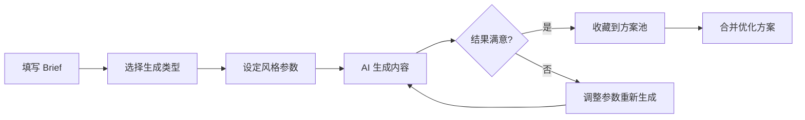
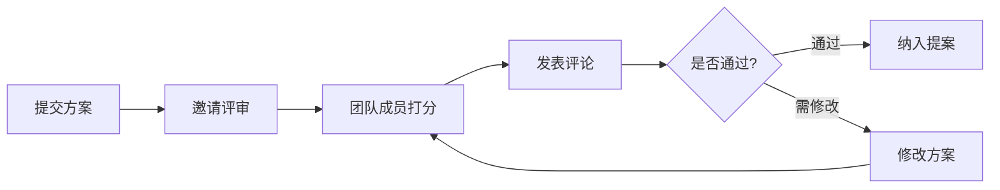

# AI 创意工厂 - 产品需求文档

## 1. 产品概述

AI 创意工厂是一款面向广告策划、短视频编导和品牌运营从业者的智能创意协作平台。通过 AI 技术辅助用户快速产出高质量的创意方案，覆盖从创意发想到提案输出的完整工作流。

**核心价值：**
- 将创意周期从数天缩短至数小时
- 通过结构化流程确保创意质量
- 支持团队协作与方案沉淀

**目标用户：**
- 广告策划人员
- 短视频编导
- 品牌运营专员
- 市场部创意团队

---

## 2. 核心功能模块

### 2.1 用户角色

| 角色 | 说明 | 核心权限 |
|------|------|----------|
| 创意策划师 | 主要使用者 | 创建/编辑/管理创意方案 |
| 团队成员 | 协作者 | 评论/打分/查看方案 |
| 项目管理员 | 统筹者 | 整合方案/生成提案 |

### 2.2 页面架构

1. **创意 Brief（首页/概览页）**
   - 项目信息填写
   - Brief 生成与管理
   - 快速入口导航

2. **灵感生成页**
   - AI 创意生成引擎
   - 多维度内容生成
   - 结果筛选与收藏

3. **方案池页**
   - 创意方案管理
   - 多方案合并
   - 成本标注与标签

4. **素材板页**
   - 参考图片上传与管理
   - 素材分类整理
   - 素材与方案关联

5. **评审页**
   - 团队评分系统
   - 评论互动
   - 提案大纲生成

---

## 3. 核心页面详情

### 3.1 创意 Brief 页

| 模块名称 | 功能描述 |
|----------|----------|
| 品牌信息区 | 输入品牌名称、Slogan、品牌调性 |
| 受众画像区 | 选择目标人群年龄段、性别、兴趣标签 |
| 渠道选择区 | 多选投放渠道（抖音、小红书、微博、B站等） |
| 限制条件区 | 填写预算范围、时间节点、特殊要求 |
| Brief 预览 | 一键生成结构化 Brief 文档 |
| 历史 Brief | 查看和复用历史 Brief |

### 3.2 灵感生成页

| 模块名称 | 功能描述 |
|----------|----------|
| 生成类型选择 | 标题/脚本/海报文案/活动玩法 |
| 风格筛选器 | 潮流/温情/搞笑/科技感/复古等 |
| 批量生成 | 一次生成 5-10 个方案 |
| 结果卡片 | 展示创意内容，支持收藏/合并 |
| AI 对话 | 追问细化方案细节 |

### 3.3 方案池页

| 模块名称 | 功能描述 |
|----------|----------|
| 方案卡片 | 展示方案标题、摘要、标签 |
| 多选合并 | 选择多个方案合并为一个 |
| 成本标注 | 标注执行成本（高/中/低） |
| 标签系统 | 自定义标签分类 |
| 搜索过滤 | 按关键词/标签/成本筛选 |

### 3.4 素材板页

| 模块名称 | 功能描述 |
|----------|----------|
| 图片上传区 | 拖拽上传参考图片 |
| 素材画廊 | 瀑布流展示所有素材 |
| 素材夹 | 创建素材分类文件夹 |
| AI 生图 | 描述生成参考图 |
| 关联方案 | 将素材关联到具体方案 |

### 3.5 评审页

| 模块名称 | 功能描述 |
|----------|----------|
| 方案展示区 | 展示待评审方案详情 |
| 评分系统 | 1-5 星评分 + 多维度打分 |
| 评论区域 | @同事发表评论 |
| 评审记录 | 查看历史评审意见 |
| 提案生成 | 一键生成提案大纲 Word 文档 |

---

## 4. 核心业务流程

### 4.1 创意生成流程

### 4.2 团队评审流程

---

## 5. UI 设计规范

### 5.1 设计风格

**设计理念：科技感 + 创意活力**

- 采用深色主题为主，突出专业感与沉浸感
- 霓虹渐变色作为点缀，营造创意氛围
- 卡片式布局，模块清晰，操作直观

### 5.2 色彩规范

| 用途 | 色值 |
|------|------|
| 主色 | #6366F1（靛蓝） |
| 辅助色 | #8B5CF6（紫罗兰） |
| 强调色 | #06B6D4（青色） |
| 背景色 | #0F172A（深蓝黑） |
| 卡片背景 | #1E293B |
| 文字主色 | #F8FAFC |
| 文字次色 | #94A3B8 |

### 5.3 字体规范

- 主标题：思源黑体 Bold / Noto Sans SC Bold
- 副标题：思源黑体 Medium
- 正文：思源黑体 Regular
- 数字强调：DIN Alternate Bold

### 5.4 交互规范

- 页面切换：淡入淡出 + 轻微位移
- 卡片悬停：微缩放 + 边框发光
- 按钮点击：涟漪扩散效果
- 加载状态：骨架屏 + 脉冲动画

---

## 6. 数据模型

### 6.1 核心实体

| 实体 | 字段 |
|------|------|
| Brief | id, brand, audience, channels, constraints, createdAt |
| Idea | id, briefId, type, content, style, cost, tags, createdAt |
| Material | id, url, name, folderId, relatedIdeas |
| Review | id, ideaId, score, comments, reviewer, createdAt |
| Proposal | id, name, ideas, outline, status |

### 6.2 存储方案

- 使用 localStorage 存储本地数据
- 模拟数据用于演示展示

---

## 7. 非功能性需求

- 首屏加载时间 < 2 秒
- 支持主流浏览器（Chrome、Edge、Firefox、Safari）
- 响应式设计，适配 1440px 及以上屏幕
- 数据本地持久化，防止刷新丢失
