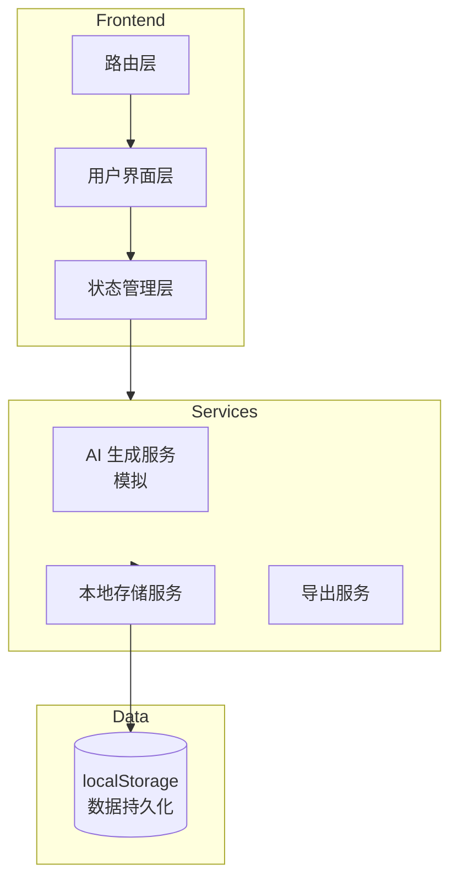

# AI 创意工厂 - 技术架构文档

## 1. 架构设计



**架构说明：**
- 单页应用（SPA），使用 React Router 管理路由
- 状态管理使用 React Context + useReducer
- 数据持久化使用 localStorage
- AI 生成使用本地模拟数据

---

## 2. 技术栈

| 技术 | 版本 | 用途 |
|------|------|------|
| React | 18.x | UI 框架 |
| Vite | 5.x | 构建工具 |
| Tailwind CSS | 3.x | 样式框架 |
| React Router | 6.x | 路由管理 |
| Lucide React | 最新 | 图标库 |
| framer-motion | 11.x | 动画效果 |

---

## 3. 路由定义

| 路由 | 页面 | 描述 |
|------|------|------|
| / | BriefPage | 创意 Brief 页面 |
| /generate | GeneratePage | 灵感生成页面 |
| /pool | PoolPage | 方案池页面 |
| /materials | MaterialsPage | 素材板页面 |
| /review | ReviewPage | 评审页面 |

---

## 4. 组件结构

```
src/
├── components/
│   ├── layout/
│   │   ├── Sidebar.tsx        # 侧边导航
│   │   ├── Header.tsx        # 顶部栏
│   │   └── Layout.tsx        # 布局容器
│   ├── brief/
│   │   ├── BrandForm.tsx     # 品牌信息表单
│   │   ├── AudienceForm.tsx  # 受众表单
│   │   └── BriefPreview.tsx # Brief 预览
│   ├── generate/
│   │   ├── TypeSelector.tsx  # 生成类型选择
│   │   ├── StyleFilter.tsx  # 风格筛选
│   │   └── IdeaCard.tsx      # 创意卡片
│   ├── pool/
│   │   ├── IdeaList.tsx      # 方案列表
│   │   ├── MergeModal.tsx    # 合并弹窗
│   │   └── CostTag.tsx       # 成本标签
│   ├── materials/
│   │   ├── UploadZone.tsx    # 上传区域
│   │   ├── MaterialGrid.tsx  # 素材网格
│   │   └── FolderTree.tsx    # 文件夹树
│   └── review/
│       ├── ScoreBoard.tsx    # 评分板
│       ├── CommentList.tsx   # 评论列表
│       └── ProposalExport.tsx # 提案导出
├── pages/
│   ├── BriefPage.tsx
│   ├── GeneratePage.tsx
│   ├── PoolPage.tsx
│   ├── MaterialsPage.tsx
│   └── ReviewPage.tsx
├── hooks/
│   ├── useIdeas.ts           # 创意数据钩子
│   ├── useBrief.ts           # Brief 数据钩子
│   └── useMaterials.ts       # 素材数据钩子
├── services/
│   ├── aiService.ts          # AI 生成服务
│   └── storageService.ts     # 存储服务
├── context/
│   └── AppContext.tsx        # 全局状态上下文
├── types/
│   └── index.ts              # 类型定义
└── utils/
    └── helpers.ts            # 工具函数
```

---

## 5. 核心数据类型

```typescript
interface Brief {
  id: string;
  brand: {
    name: string;
    slogan: string;
    tone: string;
  };
  audience: {
    ageRange: string;
    gender: string;
    interests: string[];
  };
  channels: string[];
  constraints: {
    budget: string;
    deadline: string;
    requirements: string;
  };
  createdAt: number;
}

interface Idea {
  id: string;
  briefId: string;
  type: 'title' | 'script' | 'poster' | 'activity';
  title: string;
  content: string;
  style: string[];
  cost: 'high' | 'medium' | 'low';
  tags: string[];
  liked: boolean;
  createdAt: number;
}

interface Material {
  id: string;
  url: string;
  name: string;
  folderId: string;
  relatedIdeas: string[];
  createdAt: number;
}

interface Review {
  id: string;
  ideaId: string;
  reviewer: string;
  scores: {
    creativity: number;
    feasibility: number;
    alignment: number;
  };
  comments: Comment[];
  status: 'pending' | 'approved' | 'revision';
  createdAt: number;
}

interface Comment {
  id: string;
  author: string;
  content: string;
  createdAt: number;
}
```

---

## 6. 状态管理

使用 React Context 提供全局状态：

```typescript
interface AppState {
  briefs: Brief[];
  ideas: Idea[];
  materials: Material[];
  reviews: Review[];
  currentBrief: Brief | null;
  selectedIdeas: string[];
}

type Action =
  | { type: 'ADD_BRIEF'; payload: Brief }
  | { type: 'ADD_IDEA'; payload: Idea }
  | { type: 'TOGGLE_LIKE'; payload: string }
  | { type: 'MERGE_IDEAS'; payload: string[] }
  | { type: 'ADD_MATERIAL'; payload: Material }
  | { type: 'ADD_REVIEW'; payload: Review }
  | { type: 'SET_SELECTED'; payload: string[] };
```

---

## 7. 页面交互流程

### 7.1 Brief 创建流程

1. 用户填写品牌信息、受众、渠道、限制
2. 点击"生成 Brief"创建记录
3. 跳转至灵感生成页，关联当前 Brief

### 7.2 创意生成流程

1. 选择生成类型（标题/脚本/文案/活动）
2. 选择风格标签
3. 点击生成，模拟 AI 调用
4. 展示结果卡片，支持收藏、合并

### 7.3 方案管理流程

1. 在方案池查看所有收藏的创意
2. 多选方案，点击合并
3. 填写合并后的方案信息
4. 标注执行成本

### 7.4 评审流程

1. 选择方案提交评审
2. 输入评审人姓名
3. 多维度打分（创意性/可行性/契合度）
4. 添加评论
5. 一键生成提案大纲

---

## 8. 模拟数据策略

由于是前端演示项目，AI 生成功能使用预设的模板数据进行模拟：

- **标题生成**：使用预设的标题模板 + 随机组合
- **脚本生成**：使用预设的场景模板
- **文案生成**：使用预设的风格模板
- **活动生成**：使用预设的活动类型模板

所有模拟数据存储在 `/src/data/mockData.ts` 中。

---

## 9. 性能优化

- 使用 React.memo 避免不必要的重渲染
- 使用 useMemo 和 useCallback 优化计算和回调
- 图片懒加载，减少首屏加载时间
- 使用 CSS 变量实现主题切换
- 动画使用 transform 和 opacity，避免重排
